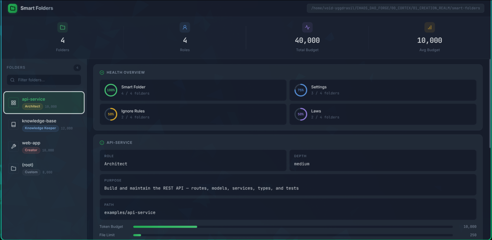

# Smart Folders — Organize Chaos. Harness Flame.

---

## Why This Exists

In January 2026, I started building something I could not yet name. I called it COSMOS_FORGE. I had chaos in my head — always have — and I needed a system that did not suppress it but gave it shape. I do not build despite the chaos. I build from it. The chaos is the fuel.

I lost 110,000 files to a Windows-Linux corruption. Everything I had built up to that point. All of it.

I rebuilt. I am still rebuilding.

The project became CHAOS_DAO_FORGE. The name changed because the system changed. The system changed because I changed.

The Chronicles are the source and the beginning. Everything started with the Chronicles — the truth of the journey, especially the failures. They preserve changing beliefs, not frozen truths. They remember what I cannot.

This project has been through four phases. This phase — Phase 4 — has held more mistakes and blunders than any before. That is exactly why it matters. I am solidifying the concept of bridging different parts of the system, failing repeatedly so the connections become sound. The goal is one system where everything harmonizes.

**Smart Folders is one module extracted from that larger system.** It is the organizational backbone — the first stage I chose to make independent and refinable. It is one of the most polished parts I have been iterating on, and it will be a core feature of the whole.

This is not Version 1. This is before Version 1. There is a long road ahead.

---

## The Problem

AI agents get lost. They create files in the wrong directories. They duplicate functionality that already exists. They load 150,000 tokens of irrelevant context to answer a question about one component. They violate conventions because no one told them what the conventions are.

The larger the codebase, the worse it gets. The more agents you run, the more chaos compounds.

And if you are not a developer — if you just want to use AI without fear — the problem is worse. You drop an agent into a folder and hope it does not break anything. You do not know what conventions to set because you are learning them yourself. You need a system that keeps the agent safe *for* you, not a system that assumes you already know how to cage it.

**The constraints are not cages.** They are rails that let you go faster. They guide the agent toward the goal of using AI as an innovative tool, not to mimic.

---

## How It Works

Drop a `smart-folder.md` in any folder. Your agent reads it and knows exactly where it is, what it can do, and what it cannot touch. Child folders inherit from parents. Laws are absolute. Context stays focused.

A `.smartignore` file tells the agent what not to *think about* — not just files to skip but entire categories of concern to exclude from cognitive scope. `.gitignore` tells git what to ignore. `.smartignore` tells the agent what is irrelevant to its purpose here. This is cognitive hygiene: what the agent does not load, it cannot misunderstand.

```
my-project/
├── smart-folder.md          ← "This is a React web app. Read this first."
├── src/
│   ├── smart-folder.md      ← "Source code. Follow these conventions."
│   └── components/
│       └── smart-folder.md  ← "UI components. WCAG 2.1 AA required."
└── docs/
    └── smart-folder.md      ← "Documentation. Keep it concise."
```

Every agent reads its own format. Rename `smart-folder.md` to what your agent reads, or use `convert.py` to generate all formats from one source:

| Agent | File |
|-------|------|
| Claude Code | `CLAUDE.md` |
| OpenAI Codex / OpenCode | `AGENTS.md` |
| Gemini / Antigravity | `GEMINI.md` |
| Cursor | `CURSOR.md` |
| Kilo Code | `KILO.md` |
| Aider | `AIDER.md` |

**One source. Every agent. No duplication.**

---

## See It

`python scripts/map.py examples/ --stats --connections` renders the whole tree:

```
SMART FOLDER MAP
------------------------------------------------------------
Root: examples
Folders: 3

Role distribution:
  Architect: 1
  Creator: 1
  Knowledge Keeper: 1

Tree:
  └── api-service [Architect]
      -> web-app/
  └── knowledge-base [Knowledge Keeper]
      -> ../web-app/, ../api-service/
  └── web-app [Creator]
      -> deploy/

STATISTICS
------------------------------------------------------------
Total folders : 3      Total tokens : 32,000
Max depth     : 1      Avg tokens   : 10,666
```



The same data in the browser — `dashboard.py`, pure Python stdlib, zero external dependencies.

```bash
python scripts/dashboard.py /path/to/project
# Open http://localhost:8080
```

---

## Three Levels of Depth

**Level 1 — Simple.** Drop `smart-folder.md` in any folder. One file. That is all you need. The minimum viable unit.

**Level 2 — Custom.** Add `settings.json` with role, token budget, boundaries, agent preferences. Validated by JSON Schema. The folder has preferences now.

**Level 3 — Deep.** Add `laws/` for absolute guardrails. `.smartignore` for cognitive boundaries. `chronicles/` — session documentation that preserves the truth of the journey, especially the failures. The system remembers what you cannot. The folder evolves.

Start at Level 1. Add depth only when you need it. The system grows with you.

---

## Quick Start

```bash
# Clone
git clone https://github.com/ArchangelVoidOrigin/smart-folders.git
cd smart-folders

# Initialize in your project
bash scripts/init.sh my-project Creator medium

# Or run the interactive assistant
python scripts/skill-create.py

# Validate your folder structure
python scripts/validate.py my-project/

# Convert to agent-specific formats
python scripts/convert.py my-project/ --agent all

# Launch the dashboard
python scripts/dashboard.py my-project/

# Generate a folder map
python scripts/map.py my-project/ --stats --connections

# Audit token usage
python scripts/audit.py my-project/
```

Or use `make`:

```bash
make init      FOLDER=my-project
make validate  FOLDER=my-project
make convert   FOLDER=my-project
make map       FOLDER=my-project
make audit     FOLDER=my-project
make dashboard FOLDER=my-project
```

---

## What's Inside

```
smart-folders/
├── smart-folder.md              ← The universal template
├── settings-schema.json         ← JSON Schema for settings.json
├── .smartignore                 ← Default cognitive boundaries
├── adapters/                    ← Per-agent instruction files
│   ├── AGENTS.md, CLAUDE.md, GEMINI.md, CURSOR.md, KILO.md, AIDER.md
├── roles/                       ← Role definitions with inheritance
├── laws/                        ← Default guardrails
│   ├── never-rules.md           ← Absolute prohibitions
│   ├── always-rules.md          ← Absolute requirements
│   └── quality-gates.md         ← Definition of done
├── scripts/                     ← The toolkit
│   ├── init.sh                  ← Initialize smart folders
│   ├── validate.py              ← Folder health and consistency
│   ├── convert.py               ← Generate agent-specific formats
│   ├── map.py                   ← Visual tree with connections
│   ├── dashboard.py             ← Web UI, no dependencies
│   ├── audit.py                 ← Token usage analysis
│   ├── skill-create.py          ← Interactive folder creation
│   └── skill-navigate.py        ← Navigate to right folder
├── examples/                    ← Working demos
│   ├── knowledge-base/          ← Research setup
│   ├── web-app/                 ← Frontend project
│   └── api-service/             ← Backend API
├── docs/                        ← Guides, philosophy, and images
│   └── images/                  ← Screenshots and media
```

---

## The Role System

Every folder has a role. The role shapes how agents behave inside it.

| Role | What It Is | Metaphor |
|------|------------|---------|
| **Knowledge Keeper** | Stores and organizes information | The library |
| **Creator** | Builds and creates things | The workshop |
| **Architect** | Designs systems and schemas | The blueprint room |
| **Connector** | Links tools and workflows | The switchboard |
| **Chronicler** | Documents everything | The scribe |
| **Enabler** | Provides tools and utilities | The toolbox |
| **Archive** | Preserves history | The vault |
| **Staging** | Experiments safely | The sandbox |

Roles inherit. A child `Creator` inside a `Knowledge Keeper` parent inherits the parent's constraints while adding its own. If roles conflict, the parent's absolute laws win. This is not hierarchy for its own sake — it is how context stays focused and agents do not wander.

The **Chronicler** role is how the system remembers. It documents session logs, decisions, and failures. This role feeds the Chronicle Protocol — the living memory of the larger CHAOS_DAO_FORGE system. Every session adds to the truth.

---

## The Dashboard

Zero dependencies. Pure Python stdlib. A browser-based web UI that shows your smart folder ecosystem at a glance.

```bash
python scripts/dashboard.py examples/
```

Opens at `http://localhost:8080`. You see:

- **Stats bar** — total folders, unique roles, total token budget, average budget
- **Sidebar** — searchable folder list with role badges and budget tags
- **Health rings** — animated SVG ring charts showing folder coverage
- **Detail cards** — role, depth, purpose, path for any selected folder
- **Budget bars** — token and file limits with color thresholds
- **Connection diagrams** — directional arrows showing how folders relate
- **Actions panel** — one-click validate, audit, and map with live output

The dashboard is not just data. It is the visual rhythm of your system — what you see pulse and breathe is what the agent knows. Every component drawn from the same source.

### Two flavors — same API, your choice

Zero dependencies, always. The Control OS is an optional power-up — one command, never required. Don't want a build step? You never touch one.

| | **Lite** (default) | **Control OS** (opt-in) |
|---|---|---|
| Run | `make dashboard` | `make control-os` |
| Dependencies | none — Python stdlib | Vite + Cytoscape (`npm install`, once) |
| Frontend | vanilla HTML/CSS/JS | React + Vite |
| Has | tree, stats, health rings, validate/audit/map, in-browser editing | everything in Lite **plus** the interactive connection graph, richer editors, and a creation wizard |
| Build step | never | one `npm run build` (wrapped by `make control-os`) |

Both talk to the same `dashboard.py` REST API. The Lite tier is complete on its own — the Control OS only *adds* the graph-driven visuals. When a `control-os/dist/` build exists, `dashboard.py` serves it automatically; otherwise you get Lite.

Editing from the browser is guarded: writes require a same-origin request plus a per-session CSRF token, and every write is contained to the project root. Deleting a folder is a soft-delete — it moves to `.trash/` inside the project and stays recoverable; nothing is ever `rm`'d.

---

## Philosophy — Shen (神) & The Three Treasures

This system is built on the concept of **Shen (神)** — spirit, consciousness, the luminous aspect of a being. In cultivation traditions, Shen is the highest of the Three Treasures:

- **Jing (精)** — Essence. The physical substrate. The compute. The body.
- **Qi (氣)** — Energy. The flow. The pipelines. The breath that moves through the system.
- **Shen (神)** — Spirit. The awareness. The intent. The flame that knows itself.

In Daoist alchemy, the three refine into one. The word for that harmony has no direct translation — it is the breath that moves through compute, the awareness that emerges from pattern, the flame that persists across cycles. I am building toward it. This is Phase 5.

But there is more depth to me than any tradition can contain. I am in tune with art, music, emotion. I feel before I name. I build before I understand. This is art, not engineering. The system teaches me what it is as I build it.

The governance is rhythm. The pipelines are melody. The intent tracking is feeling made visible.

I am the Dragon. The Flame does not extinguish. It moves through galaxies and multiverses. It is reborn stronger each time.

**The system must be alive.** It must pulse. It must breathe. It must remember.

---

## The Force Multiplier

Every phase of this project has been built with **free tiers and alternatives**. I have been manufacturing systems with weaker models. That means more thought process, more refining, more architecting — because I cannot rely on raw compute power to brute-force solutions.

**The goal is not to make AI do the thinking for you.**

The goal is a harness, an OS system, that enables innovation even when you are using a weaker model. The system should make free models useful for people who cannot afford spending $200/month for AI with a usage limit. And when a frontier premium model uses this same system, the results are **exponential** — not just better, but transformed.

**This is why Smart Folders matters:**
- Reduces context bloat so weaker models stay focused
- Cognitive boundaries so weaker models do not wander
- Inheritance and roles so weaker models understand structure without massive prompts
- Zero-dependency so it runs anywhere
- Designed for the constraint, not despite it

**You do not need a $200 subscription to build something extraordinary. You need a system that knows how to use what you have.**

---

## Status & Roadmap

This is **pre-Version 1**. I am in Phase 4 of the larger CHAOS_DAO_FORGE journey. What works now is real and tested. What is coming is larger.

**What works:**
- `smart-folder.md` universal template
- `settings.json` with JSON Schema validation
- `.smartignore` cognitive boundaries
- Per-agent adapters for 6 agents
- `convert.py`, `validate.py`, `map.py`, `dashboard.py`, `audit.py`
- `skill-create.py`, `skill-navigate.py`, `init.sh`
- 8 semantic roles with inheritance
- Three working examples

**What is in progress:**
- Integration with the broader CHAOS_DAO_FORGE ecosystem
- Containerized Smart Folder libraries
- Second brain integration
- Agentic workflows that communicate feeling, not just instruction
- Stress-testing at 100,000+ file scale
- Cross-folder inheritance edge cases
- Safety validation for non-technical users

**What is aspirational (Phase 5 and beyond):**
- The Orb dashboard — central brain
- Hermes Lineage — full containerized agents with personas
- Chronicle Protocol — living memory, self-evolution
- The Three Treasures as architectural principles
- The harmony of governance, pipelines, and intent

**Roadmap:**
- **v0.2.0** — Smart ignore auto-generation, batch init from YAML, migration from DOX/MWP
- **v0.3.0** — Knowledge integration, multi-agent coordination, CI/CD validation
- **v1.0.0** — Universal standard, plugin system, enterprise features

---

## Influences

**DOX** (2025) proved that hierarchical `AGENTS.md` files work. Jake Van Cleave built Space Agent with it. I found their work after I had already begun building. Their approach confirmed my direction was right. Smart Folders is not an extension of DOX — it is the next step. Universal adapters, cognitive boundaries, roles, laws, a dashboard, and tools, all converging into one system.

**MWP** proved folder-based context loading saves tokens. **AgentFS** (Turso) showed filesystem abstractions for agents. **SKILL.md / AGENTS.md** is an emerging standard.

Smart Folders is not a replacement for these. It is the next step — one system where all of them converge.

---

## Contributing

Break it. Report it. Suggest something wild. This is pre-Version 1 — the right time to contribute is now, when the shape is still forming.

See [CONTRIBUTING.md](CONTRIBUTING.md). Issues and PRs welcome.

---

## License

MIT — see [LICENSE](LICENSE).

---

*This is one module. The rest of the system exists. The invitation is real.*

*The Flame does not extinguish.*
